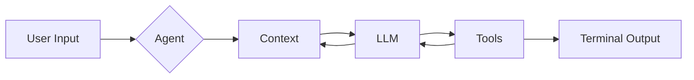

# Meet Bookly!

<b>Tools Used: </B> Claude Code, Anthropic (Claude Sonnet 4.5), Node.js, Express.js, Zod, Vercel AI SDK

Hi! Meet Bookly - your CX chat agent!

### Architecture Overview

<b>User Input:</b> The process kicks off with looking to check the status of their order, request a refund, or ask a question.

<b>Agent:</b> The agent intercepts the question. We've made the agent purpose built to as a question to clarify the user has made the right selection, give the user the ability to change their selection.

<b>Context :</b> Once the user makes their selection and confirms it, we store that selection in memory so we have information into why that user reached out today - here we also want to make sure we've checked the full history of the conversation.

<b>LLM/Prompting:</b> We've purpose built the prompt to be Customer Support focused with the goal of help the customer make sure they are taken care of. This includes letting them know their expertise, giving a solid structure for the agent to work off of, and being able to iterate on it as you see success and responses.

> **order-check**: "You are a friendly customer support agent for Bookly. The customer wants to check on their order status. You already asked whether they have an account or checked out as a guest — their answer is included as the first message. Based on their answer, guide them accordingly..."

> **refund**: "...The customer wants a refund. You already asked what is prompting their refund... Be empathetic and acknowledge their reason. Then ask for their order number... Explain the refund policy (30-day return window, original condition, digital purchases non-refundable)..."

> **general**: "...The customer has a general question. You already asked about the nature of their question... You can help with shipping policies, password resets, account issues, gift cards, and more."

> **chat** (fallback): "...Help the customer with whatever they need."
>
> <b> Tools: </b> We've used tools like Zod to help maintain a level of structure and an important piece to ensure our LLM output is received and make sure the process we're outlining continues with minimal to no interruptions, as well to limit hallucinations. @Clack help for the CLI application to take shape and really render all that encompasses Bookly as a CLI application. Vercel SDK is big as we think of agent executing everything incoming, it is also agnostic so we could've use any AI model to support us at Bookly

<b> Terminal Output: </b> This is really what we've wanted to achieve! A response from our agent that allows for customers make a selection and know that the agent is purpose-built to help them accomplish even the biggest tasks from a customer experience standpoint!

### Production Tradeoffs

This form of Bookly, while great, could use a few enhancements before I would push it to production. Theres <b>3</b> key additions I would add to improve on this agent.

<b>1. Memory</b>: For this, we use a lightweight memory layer to make sure we were capturing short-term conversations within the session, just so the agent has ability to handle components like multi-turn or reaching out to a tool. In a production agent, I'm looking at a tool that provides the ability to have information provided in the short term as well as long-term memory so we're keeping up with everything over time and allowing for personalization as time continues

<b>2. Multi-Channel/Multi-Agent </b>: Within Bookly, we focused on an agent that would handle tasks via chat functionality, which solves a ton of use cases. In production, the thought would be on multi-channel systems and multi-agent agent architecture to accomplish a few things: 1. allowing ourselves to meet our customers where they are and expand our ability to scale. 2. That though alone means we want to start to think about separation of concerns so we don't find ourselves running into issues (latency, bugs). Multi-agent allows for us to define who owns what and to focus on that. As you think about combining 1 & 2, we now solve a big issue many enterprises face when going down this journey, allowing for context <b> across </b> agents.

<b>3. Guardrails: </b> Like any other production solution, one of the best things we can bring into it would be guardrails that support pre and post execution for the agent. I think of things like security to protect from prompt injections as we think of passing more expansive prompts to a multi-agent solution in the future. There's also accuracy of our responses post execution. The more accurate our responses are, the more efficient the agent will be responding to customers would lead to a decrease in our costs.

<b> 4. Decision Design </b> Candidly, one piece that could be improved on and that I'd hope for within a product agent is better decision design. When I say that I mean the flexibility the agent takes when it is working off of a script, better error handling if our guardrails do fail. The reality is we want these agents to continue to build on their train of though and how they execute and with more robust decision design, I feel like that makes for a very production ready agent.
